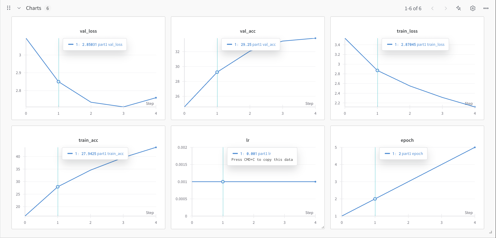
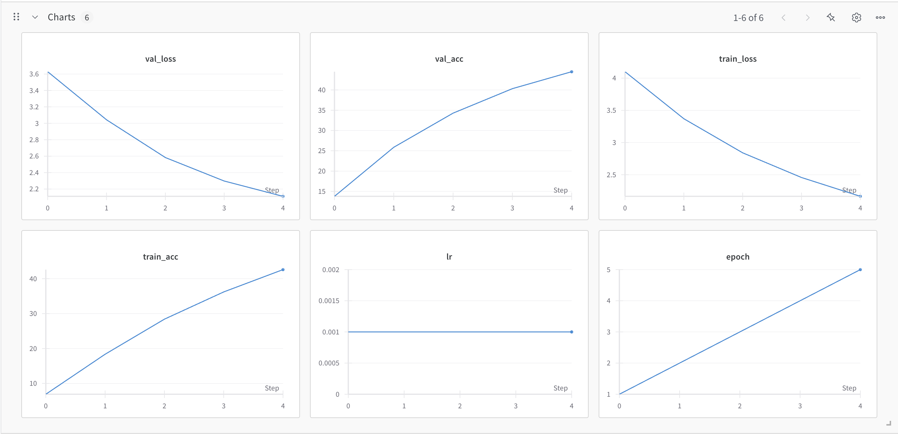
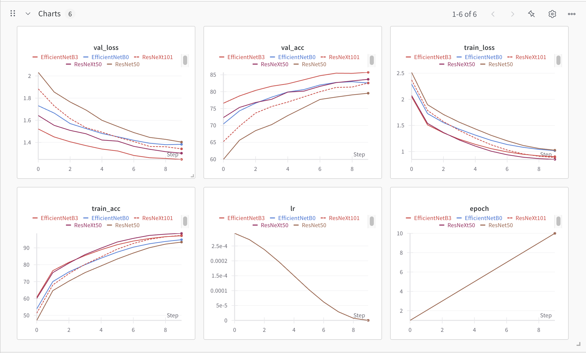

# Midterm Project Report
**Author**: Junhui Cho

**Due Date**: March 30, 2025

## AI Disclosure

### General Usage

Primary Generative AI Tool: ChatGPT 4o

Generative AI was mainly used for research purposes. Following is the detailed list of how I utilized the tool:

1. List of CNN-based models
2. List of Optimizers
3. List of Learning Rate Schedulers
4. Suggetions for generalization
    - For the context, I have provided my training script as an input, and asked for suggestions to mitigate overfitting and improve generalization.

### AI-Generated Code

**Design of Head layer for transfer learning**:

In the beginning, I started simply with a fully connected layer, but I wanted to test if some change in head layer could help to mitigate overfitting. I requested for dropout, and additional pooling layer.

```bash
class HeadWithPooling(nn.Module):
    def __init__(self, in_features, num_classes):
        super().__init__()
        self.bn1 = nn.BatchNorm1d(in_features)
        self.dropout1 = nn.Dropout(0.5)
        self.linear1 = nn.Linear(in_features, 512)
        self.relu = nn.ReLU()
        self.pool = nn.AdaptiveAvgPool1d(1)
        self.flatten = nn.Flatten()
        self.linear2 = nn.Linear(512, num_classes)

    def forward(self, x):
        x = self.bn1(x)
        x = self.dropout1(x)
        x = self.linear1(x)
        x = self.relu(x)
        x = x.unsqueeze(-1)      # (B, 512) -> (B, 512, 1)
        x = self.pool(x)         # (B, 512, 1)
        x = self.flatten(x)      # (B, 512)
        x = self.linear2(x)      # (B, 100)
        return x
```

**Functions for freezing and unfreezing backbone**:

To test if freezing the backbone for first few epochs helps, I requested for helper functions that freeze and unfreeze parameter updates.

```bash
def freeze_backbone(model):
    for name, param in model.named_parameters():
        if "fc" not in name:
            param.requires_grad = False

def unfreeze_all(model):
    for param in model.parameters():
        param.requires_grad = True
```

Remaining parts of the code are generated by myself.

## Part 1: Simple CNN

### Model Description


Following is the design for simple CNN model. I tried to minimalize the model so that I can observe the baseline performance of the simplest form of CNN-based architecture.

```bash
class SimpleCNN(nn.Module):
    def __init__(self):
        super(SimpleCNN, self).__init__()
        # TODO - define the layers of the network you will use
        self.conv1 = nn.Conv2d(3, 16, kernel_size=3, stride=1, padding=1)
        self.conv2 = nn.Conv2d(16, 32, kernel_size=3, stride=1, padding=1)

        self.pool = nn.MaxPool2d(kernel_size=2, stride=2)

        self.fc1 = nn.Linear(32 * 8 * 8, 256)
        self.fc2 = nn.Linear(256, 100)
        
    def forward(self, x):
        # TODO - define the forward pass of the network you will use
        x = self.pool(F.relu(self.conv1(x))) # Pooling + Convolution 1
        x = self.pool(F.relu(self.conv2(x))) # Pooling + Convolution 2
        x = x.view(-1, 32 * 8 * 8)  # Flatten the tensor
        x = F.relu(self.fc1(x)) # Activation
        x = self.fc2(x) # Output layer

        return x
```

#### Components
- Convolution Layers:
    - `conv1`, `conv2`
- Pooling Layer:
    - `pool`
- Fuclly Connected Linear Layers:
    - `fc1`, `fc2`

### Configuration, Augmentation, Loss Function, Optimizer, and Learning Scheduler

For the base model, I ran it on my local machine, so I trained it just for 5 epochs. For the loss function, I used `CrossEntropyLoss()`, which is a commonly used loss function for multi-class classification problems. No additonal arguments were included to test the baseline performance. `Adam` was chosen for the optimizer as it is one of thje most popular optimization algorithms used to train deep learning models.

Hyperparameter tuning and regularization were not involved in part 1.

Data Augmenation was also not applied, and only the given normalization was applied.


```bash
CONFIG = {
        "model": "CNN_base_model",   # Change name when using a different model
        "batch_size": 8, # run batch size finder to find optimal batch size
        "learning_rate": 0.001,
        "epochs": 5,  # Train for longer in a real scenario
        "num_workers": 4, # Adjust based on your system
        "device": "mps" if torch.backends.mps.is_available() else "cuda" if torch.cuda.is_available() else "cpu",
        "data_dir": "./data",  # Make sure this directory exists
        "ood_dir": "./data/ood-test",
        "wandb_project": "sp25-ds542-challenge",
        "seed": 42,
    }

transform_train = transforms.Compose([
        transforms.ToTensor(),
        transforms.Normalize((0.5, 0.5, 0.5), (0.5, 0.5, 0.5)), # Example normalization
    ])

transform_test = transforms.Compose([
        transforms.ToTensor(),
        transforms.Normalize((0.5, 0.5, 0.5), (0.5, 0.5, 0.5)), # Example normalization
    ])   ### TODO -- BEGIN SOLUTION

criterion = nn.CrossEntropyLoss()   ### TODO -- define loss criterion
optimizer = optim.Adam(model.parameters(), CONFIG['learning_rate'])
scheduler = None
```

### Results

#### Learning Curves



First of all, the model is learning effectively during training. Training loss is steadily decreasing, and validation loss is also decreasing except for the last epoch. The increase at the end suggests early signs of overfitting, but we cannot say that for sure with just 5 epochs, especially given that we are training the model from scratch.

A fixed learning rate is working just fine for this case because this is an early stage of training and the model does not require sensitive touch at this stage.

There is clearly a lot of room for improvement. Since the model was only trained for 5 epochs, the most obvious next step is to increase the number of training epochs to allow the network more time to learn patterns from the data. The relatively low overall accuracy and the slight uptick in validation loss toward the end suggest that the model has not yet converged at all.

#### Leaderboard Public Score

| Model Name  | Description           | Accuracy  |
|-------------|-----------------------|-----------|
| SimpleCNN   | Baseline CNN model    | 0.20138   |


## Part 2: More Sophisticated CNN Model

### Model Description

For part 2, I explored a more sophisticated CNN by using the predefined ResNet-18 model from the `torchvision` library.

I chose to use the ResNet model because of its strong performance on the CIFAR-100 benchmark compared to other standard convolutional neural networks. When researching various architectures recommended by ChatGPT, I found that ResNet consistently achieved high accuracy across multiple datasets. Therefore, I safely assumed that ResNet architecture is the perfect fit to begin with.

Rather than designing a more complex custom CNN, I was motivated by the fact that this is my first time working with CNNs so I wanted to try using a predefined architecture like ResNet-18. Even though part 2 requires more sophisticated steps, I still tried my best not to over-complicate the process other than the architecture because I wanted to test solely on how much SOTA architecture improves the model performance. There are heavier ResNet models available, but the main purpose of part 2 was to provide another baseline for part 3, so I decided to stick to the lightest version.

Additionally, using a standard model like ResNet-18 provides a strong point of comparision for part 3 of the project, which involves transfer learning using pretrained weights. By training ResNet-18 from scratch in this part and fine-tuning it with pretrained weights in the next, I wish to draw meaningful insights about the impact of pretraining and transfer learning on model performance and convergence speed.

```bash
model = resnet18(weights=None)
```

### Configuration, Augmentation, Loss Function, Optimizer, and Learning Scheduler

Equivalent to part 1, part 2 was trained on my local machine without GPU access, so I tried to minimize the training process. Basically, there is no difference in configuration setting.

However, a few changes were made to run the model effectively on the CIFAR-100 dataset. First of all, input images were resized to 224×224 because ResNet-18 was originally designed and trained on the ImageNet dataset, which uses higher-resolution images. Additionally, I replaced the final fully connected layer of the ResNet-18 model to output 100 classes instead of the default 1000, in order to match the CIFAR-100 classification task. An important step to note here is that the OOD (Out-of-Distribution) test images were also resized to 224×224 to ensure consistency with the input size expected by the model.

In addition, I slightly adjusted imagen normalization scale from `transforms.Normalize((0.5, 0.5, 0.5), (0.5, 0.5, 0.5))` to `transforms.Normalize((0.5071, 0.4865, 0.4409), (0.2673, 0.2564, 0.2761))` because I wanted to apply the same normalization scale as it does in the provided `evaluation_ood.py`. Moreover, I added a simple data augmentation, `RandomHorizontalFlip()`.

Hyperparameter tuning and regularization were also not applied for part 2, so the model was trained with a fixed learning rate of `0.001`.

```bash
CONFIG = {
    "model": "ResNet18_scratch",   # Change name when using a different model
    "batch_size": 8, # run batch size finder to find optimal batch size
    "learning_rate": 0.001,
    "epochs": 5,  # Train for longer in a real scenario
    "num_workers": 8, # Adjust based on your system
    "device": "mps" if torch.backends.mps.is_available() else "cuda" if torch.cuda.is_available() else "cpu",
    "data_dir": "./data",  # Make sure this directory exists
    "ood_dir": "./data/ood-test",
    "wandb_project": "sp25-ds542-challenge",
    "seed": 42,
}

transform_train = transforms.Compose([
    transforms.Resize(224),
    transforms.RandomHorizontalFlip(),
    transforms.ToTensor(),
    transforms.Normalize((0.5071, 0.4865, 0.4409), (0.2673, 0.2564, 0.2761)),  # CIFAR-100 stats
])

# Validation and test transforms (NO augmentation)
transform_test = transforms.Compose([
    transforms.Resize(224),
    transforms.ToTensor(),
    transforms.Normalize((0.5071, 0.4865, 0.4409), (0.2673, 0.2564, 0.2761)),
])   ### TODO -- BEGIN SOLUTION

model = resnet18(weights=None)   # instantiate your model ### TODO
model.fc = nn.Linear(model.fc.in_features, 100) # Head

criterion = nn.CrossEntropyLoss()   ### TODO -- define loss criterion
optimizer = optim.Adam(model.parameters(), lr=0.001)  ### TODO -- define optimizer
scheduler = None
```

### Results

#### Learning Curves



The model was trained from scratch for 5 epochs on CIFAR-100, and the training metrics show stead and promising progress. Both training and validation losses decreased consistently across all epochs, indicating that the model is successfully learning meaningful representations from the data.

The close performance between training and validation accuracy suggest the model is generalizing well and there is no significant overfitting observed during this early stage of training.

The learning rate was held constant at 0.001, which appears to be effective for this setup. Considering the low accuracy on both training and validation, the obvious improvement to make here is to increase the number of epochs. Then, we will be able to observe at what point it starts to converge, and see early signs of overfitting. Based on that, we can add more augmentation and regularization techniques.

#### Leaderboard Public Score

| Model Name  | Description                                         | Accuracy  |
|-------------|-----------------------------------------------------|-----------|
| ResNet-18   | Baseline ResNet model without pretrained weights    | 0.36790   |


## Part 3: Transfer Learning from a Pretrained Model

For Part 3, my goal was to fine-tune a pretrained model on CIFAR-100 and achieve strong generalization performance on a custom OOD (out-of-distribution) dataset. From prior analysis and leaderboard benchmarks, I found that top-performing models typically used Transformer-based architectures or high-capacity CNNs such as ResNet and EfficientNet. Among CNNs, ResNeXt models consistently demonstrated ~5% improvement over  ResNets, so I began by experimenting with ResNet-50, then transitioned to ResNeXt-50 (32x4d) and ResNeXt-101 (32x8d) for stronger performance. At the end, I switched to EfficientNet with same hyperparamemters, and it boosted the performance to about 70% on OOD dataset.


### Hyperparameter Tuning

I experimented with the following hyper parameters: 

| Hyperparameter | Final Choice | Notes     |
|----------------|--------------|-----------|
| Learning Rate  | 3e-4         | Higher learning rate helps faster adaptation during early fine-tuning  |

I also experimented with warm restarts and staged scheduling (fixing LR for first few epochs), but ultimately found that a simple CosineAnnealingLR over 10 epochs consistently produced strong and stable results.

### Regularization Techniques

To mitigate overfitting and encourage generalizaion, I applied the following:
- Label Smoothing (0.1) in CrossEntropyLoss helped soften the targets.
- Dropout is the most straightforward way to generalize, so I tested it inside the custom classifier heads, but did not consistently outperform the simpler design. It definitiely added noise throughout the training, but it did not improve the overall performance on OOD dataset.
- Weight Decay $(1e^{-4})$ via AdamW added L2 regularization and helped with generalization. Tested on the range from $3e^{-4} to 1e^{-5}$, but $1e^{-4}$ consistently gave stable results. There were no signifcant differences.
- Backbone freezing for the first few epochs was also tested. In theory, I thought this would make a huge difference as it uses more of pretrained weights, but it actually made it perform worse. This is likely becuase the pretraiend backbone quickly adapted to CIFAR-100 without needing staged training, considering that my best models only required 10 epochs for finetuning.

### Data Augmentation Strategy

Data augmentation played a key role in improving generalization and performance, espeically on the OOD dataset. I iterated on several combinations including:
1. RandomHorizontalFlip
2. RandAugment
3. RandomCrop
4. ColorJitter
5. RandomErasing

Initially, I started with just `RandomHorizontalFlip` and `RandAugment`, and one by one to test how much they help in generalize. Unfortunately, adding more augmentations definitely slowed down the convergence, but did not help with overall performance. I increased the number of epochs as I added more augmentations, but it did not help. Ultimately, having just RandAugment and RandomHorizonFlip resulted in highest accuracy for the test dataset.

### Model Description

I began with ResNet-50, which served as a strong baseline and consistently achieved around 60% accuracy on the OOD test set and approximately 99% training accuracy and 83% validation accuracy, indicating solid convergence but limited generalization. To improve generalization, I transitioned to ResNeXt-50 (32x4d), which under the same training environment boosted OOD accuracy by ~5%, reaching 65%, while maintaining similar training and validation performance. This improvement in OOD performance highlighted ResNeXt’s enhanced representational power and better inductive bias, likely due to its grouped convolutions enabling more diverse feature extraction. Encouraged by these results, I also experimented with EfficientNet, known for its compound scaling of depth, width, and resolution. Starting with EfficientNet-B0, I observed comparable performance to ResNeXt-50 (~65% OOD), and moving to a larger variant, EfficientNet-B3, pushed the OOD accuracy further to 70%. Despite exploring several architectural modifications and regularization strategies, the simplest classification head designs consistently performed the best, reinforcing that the pretrained backbone played a more significant role than head complexity in achieving strong generalization on CIFAR-100.

One modification made was resizing the input size to 300 instead of 224 to fit EfficientNetB3 architecture.

```bash

CONFIG = {
    "model": "EfficientNetB3",   # Change name when using a different model
    "batch_size": 16, # run batch size finder to find optimal batch size
    "learning_rate": 3e-4,
    "epochs": 10,  
    "num_workers": 4, # Adjust based on your system
    "device": "mps" if torch.backends.mps.is_available() else "cuda" if torch.cuda.is_available() else "cpu",
    "data_dir": "./data",  # Make sure this directory exists
    "ood_dir": "./data/ood-test",
    "wandb_project": "sp25-ds542-challenge",
    "seed": 42,
}

transform_train = transforms.Compose([

    transforms.RandomHorizontalFlip(),
    transforms.RandAugment(num_ops=2, magnitude=9),  # Keep this
    transforms.Resize(300),  # Resize for ResNet input
    transforms.ToTensor(),
    transforms.Normalize((0.5071, 0.4867, 0.4408), (0.2675, 0.2565, 0.2761)),
    value='random')
])

transform_test = transforms.Compose([
    transforms.Resize(300),
    transforms.ToTensor(),
    transforms.Normalize((0.5071, 0.4867, 0.4408), (0.2675, 0.2565, 0.2761)),
])   ### TODO -- BEGIN SOLUTION

model = efficientnet_b3(weights=EfficientNet_B3_Weights.DEFAULT)

model.classifier = nn.Sequential(
        nn.Linear(model.classifier[1].in_features, 100)
    )

criterion = nn.CrossEntropyLoss(label_smoothing=0.1)   ### TODO -- define loss criterion
optimizer = torch.optim.AdamW(model.parameters(), lr=CONFIG['learning_rate'], weight_decay=1e-4)  ### TODO -- define optimizer
scheduler = torch.optim.lr_scheduler.CosineAnnealingLR(optimizer, T_max=CONFIG["epochs"]) ### TODO -- you can optionally add a LR scheduler
```

### Results

#### Learning Curves for Top 5 Models



EfficientNetB3 demonstrated the highest generalization capability, achieving a validation accuracy of ~85% with the lowest validation loss across all models. EfficientNetB0, ResNeXt50 and ResNeXt101 followed closely, reaching around 81–83% val_acc, with B0 exhibiting slightly more consistent training behavior and ResNeXt50 maintaining slightly better validation loss.

Interestingly, ResNeXt101, despite being deeper than ResNeXt50, did not outperform it. The model showed signs of overfitting, likely due to the model’s high capacity relative to the training setup and limited number of epochs. Lastly, ResNet50, although widely used, fell behind the other models with the lowest validation accuracy (~79%) and the highest validation loss.

In terms of training accuracy and loss, all models converged quickly and reached high accuracy (90–99%) within 10 epochs. EfficientNetB3 again stood out by not only achieving high training accuracy but also maintaining a smooth and consistent convergence pattern, indicating strong optimization properties. ResNeXt101 showed comparable training metrics but struggled to generalize as effectively.

#### Leaderboard Public Score

| Model Name  | Accuracy  |
|-------------|-----------|
| ResNet-50   | 0.62043   |
| ResNeXt-50  | 0.65703   |
| ResNeXt-101 | 0.65083   |
| EfficientNetB0 | 0.64002 |
| **EfficientNetB3** | **0.70158** |
